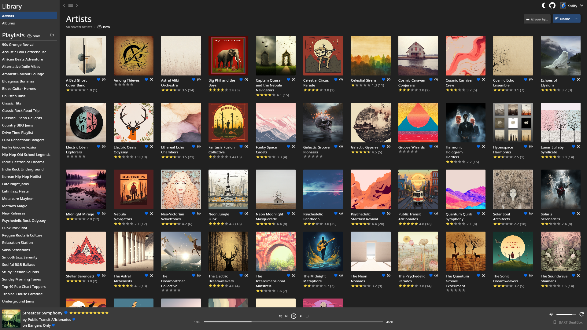
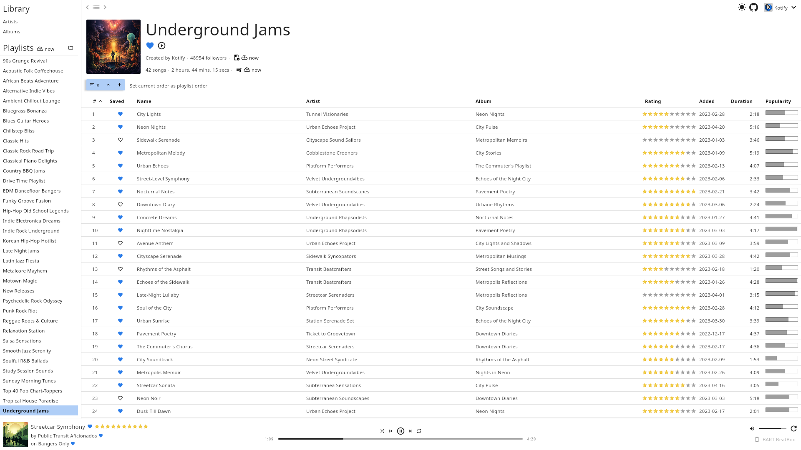
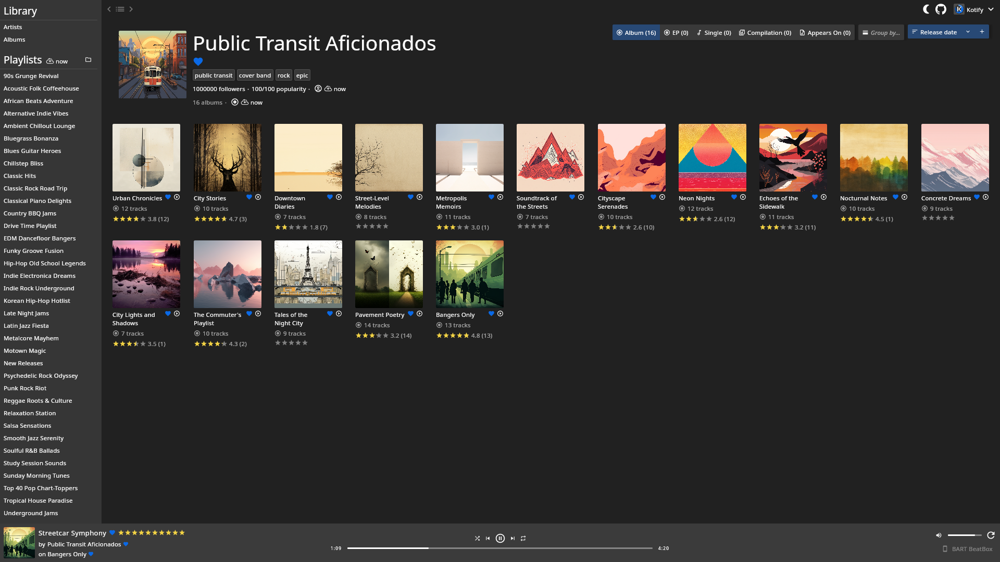

  

|  |  |
|------------------------------------------------------------------------------------------------------------------|--------------------------------------------------------------------------------------------------------------------|
|   |     |

Kotify is a multiplatform desktop client for [Spotify](https://www.spotify.com/) focused on library organization for
power users. It is free, open source, and does not collect any data.

Kotify acts as a replacement for Spotify's official desktop application and can be used to browse and manage your
Spotify library and control playback. Kotify adds:
* light and dark theme
* track ratings on a 10-star scale
* full-screen grid of saved artists and albums
* local caching of data for instant page loads

Planned features include:
* organize music by genre, rating, play count, and more
* tools to maintain your library - see playlists a song is in, newly released albums not yet added, etc
* edit song metadata or add custom fields
* auto-generated playlists, e.g. all songs with a rating of 10 stars
* deduplication of albums and tracks (see for example
  [this issue](https://community.spotify.com/t5/iOS-iPhone-iPad/Duplicates-of-the-same-albums/td-p/4542505))

For a full list of completed and upcoming features, see the [Roadmap](https://coda.io/@dominic-zirbel/kotify-roadmap).

### Installation

Kotify can be installed as an early **alpha** release. Expect performance issues, bugs, and missing features. In
particular, basic feature parity is expected in 0.2.0 and performance optimizations in 0.3.0 (see the
[Roadmap](https://coda.io/@dominic-zirbel/kotify-roadmap) for details). While efforts will be made to migrate data
(ratings, etc) between releases, this is not guaranteed. Use at your own risk.

Latest release: [0.1.0](https://github.com/dzirbel/kotify/releases/tag/v0.1.0)

#### Downloads

|                                          Windows                                           |                                          macOS                                           |                                          Linux                                           |
|:------------------------------------------------------------------------------------------:|:----------------------------------------------------------------------------------------:|:----------------------------------------------------------------------------------------:|
|     [EXE](https://github.com/dzirbel/kotify/releases/download/v0.1.0/Kotify-0.1.0.exe)     |    [DMG](https://github.com/dzirbel/kotify/releases/download/v0.1.0/Kotify-1.0.0.dmg)    |    [DEB](https://github.com/dzirbel/kotify/releases/download/v0.1.0/kotify_0.1.0.deb)    |
|     [MSI](https://github.com/dzirbel/kotify/releases/download/v0.1.0/Kotify-0.1.0.msi)     |                                                                                          |    [RPM](https://github.com/dzirbel/kotify/releases/download/v0.1.0/kotify-0.1.0.rpm)    |
| [JAR](https://github.com/dzirbel/kotify/releases/download/v0.1.0/Kotify-windows-0.1.0.jar) | [JAR](https://github.com/dzirbel/kotify/releases/download/v0.1.0/Kotify-macos-1.0.0.jar) | [JAR](https://github.com/dzirbel/kotify/releases/download/v0.1.0/Kotify-linux-0.1.0.jar) |

### How does it work?

Kotify uses Spotify's [web API](https://developer.spotify.com/documentation/web-api/) to retrieve
artist/album/song information, manage your library, and play music.

After installing, the application will request permission from Spotify to read and modify your
library. This one-time process will open Spotify in your web browser, and uses the
[OAuth protocol](https://oauth.net/2/). You may need to log in to Spotify in your web browser to grant permission, but
you will never need to provide your Spotify password to Kotify. You may remove Kotify's access at any time on Spotify's
[Manage Apps](https://www.spotify.com/us/account/apps/) page.

Once installed and authorized, Kotify can replace using Spotify's desktop client for browsing and organizing your
Spotify library. However, Kotify cannot directly play music from Spotify. You'll need to keep Spotify's client (or
another device, like a phone) running in the background through which Kotify can play music.

### Why "Kotify"?

The name Kotify is a play on Spotify and [Kotlin](https://kotlinlang.org/), the language this project is written in.
It also likens to "codify", meaning to systematize.
